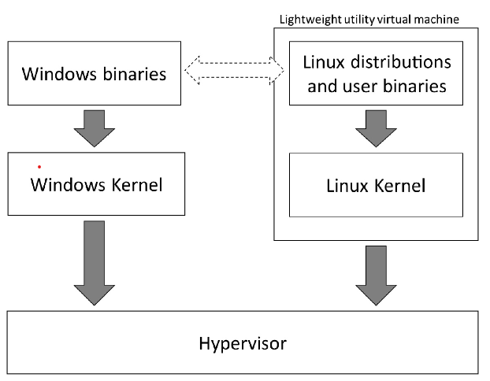

# VSCode + WSL2搭建

### 0 What is WSL2？

​		WSL（Windows Subsystem for Linux）是Windows开发的新功能——支持在没有额外虚拟机的情况下，让Linux环境运行于Windows之上。

> ​	Windows Subsystem for Linux** (**WSL**) is a feature of Windows that allows developers to run a Linux environment without the need for a separate virtual machine or dual booting.

​		**WSL1**的思想是在Linux和Windows Kernel之间引入一层Transfer Layer，当Linux 二进制文件运行并进行SystemCall时，实际而言，将调用WSL转换层，而后由转换层去调用Windows Kernel。


​		

​		然而WSL1也存在一些缺点：（1）转换层通常将带来性能上的损失。（2）一些Linux的SystemCall在WSL上并没有实现。

​		WSL2针对上述的问题，提出的了新的解决方案——Hypervisor，这样就避免了WSL1的转换层问题。如下图所示WSL2上运行着Linux Kernel，你可以从https://github.com/microsoft/WSL2-Linux-Kernel  获取它的源码。



### 2 How to install WSL2?

​		在微软官网上提供了两种方案方式。**”安装WSL“**以及我采用的**“旧版本的手动安装步骤”**

https://learn.microsoft.com/zh-cn/windows/wsl/install-manual。PS：新版的安装步骤对于你的windows版本有一定的要求。

```shell
// 启用“适用于 Linux 的 Windows 子系统”可选功能。记得重启
dism.exe /online /enable-feature /featurename:Microsoft-Windows-Subsystem-Linux /all /norestart

// 启用虚拟机功能。记得重启
ism.exe /online /enable-feature /featurename:VirtualMachinePlatform /all /norestart

// 安装wsl_update_x64.msi

//  将WSL 2设置为默认版本
wsl --set-default-version 2

// 在微软商店安装Linux发行版本，例如Ubuntu

// 启动Ubuntu，设置账户和密码

// 接下来你就可以通过wsl指令进入Linux了
```

### 3 Remote-WSL

​		首先在Vscode商店中找到**WSL插件**


​		安装完成后，Ctrl+Shift+P，输入**WSL**，选择**Connect to WSL**。这样你就可以远程连上你的WSL环境了。


### 4 References

【1】https://en.wikipedia.org/wiki/Windows_Subsystem_for_Linux#cite_note-announcing-wsl-2-5

【2】https://subscription.packtpub.com/book/cloud-and-networking/9781800562448/2/ch02lvl1sec04/exploring-the-differences-between-wsl-1-and-2
